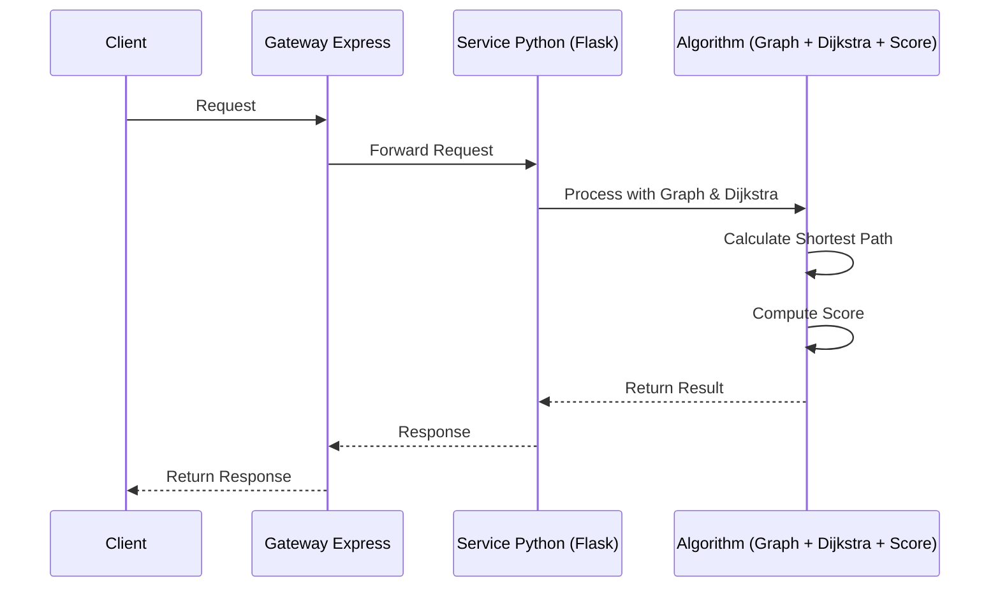

<!-- README.md -->
# README

## Définition du projet

### Contexte

Intervention pour un grand compte de l'énergie souhaitant moderniser son système d'aide à la décision pour le pilotage de son parc nucléaire. Le besoin identifié est clair : les besoins en énergie, en fonction des fluctuations de consommation doivent être détecter et déclencher un ajustement des ressources de production qui satisferont ce besoin, ou ne pourront pas.

### Données

Données disponibles au format JSON -> importation dans mongoDB ?

### Architecture

## Installation

## Utilisation

