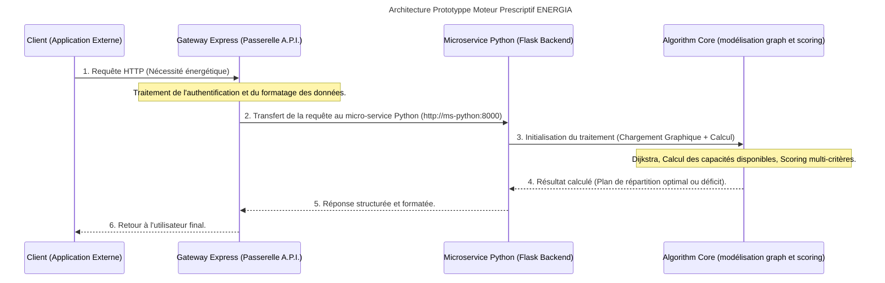

# Projet ENERGIA : Système d'aide à la décision pour le pilotage de parc nucléaire

Ce projet est une intervention complète visant à moderniser le système d'aide à la décision (SAD) d'un grand compte du secteur de l'énergie. Son objectif principal est de déterminer, en temps réel et de manière optimale, un ajustement des ressources de production capable de satisfaire les besoins énergétiques fluctuants observés sur le réseau nucléaire, ou de quantifier précisément le déficit en cas d'impossibilité de couverture.
## Architecture globale du système

Le système est conçu selon une architecture orientée microservices pour garantir la scalabilité et l'isolation des préoccupations (separation of concerns). Le flux de données suit un chemin strict, passant toujours par une passerelle unique.

### Schéma de flux séquentiel



### Composants techniques principaux

* **Gateway Express (gateway/):** la passerelle API (Node.js/Express).
    C'est le seul point d'entrée autorisé pour tout client externe. Elle gère le routage, la validation des requêtes et assure que les communications internes se font via un protocole strict vers le backend Python.

* **Service Python (ms-python/):** le cœur de la logique métier.
    Ce micro-service implémente l'ensemble des calculs complexes : modélisation du réseau, algorithmes de cheminement et d'optimisation. Il est construit en utilisant Flask pour exposer ses fonctionnalités via une API REST interne.

* **Moteur algorithmique (modélisation graph) : ** les traitements lourds
    **Modélisation :** Traitement des données du parc nucléaire (nodes/sommets = centrales, edges/arêtes = liaisons).
    **Optimisation de cheminement :** Implémentation de l'algorithme de Dijkstra pour trouver le chemin le plus court entre deux points dans le réseau maillé.
    **Calcul des capacités disponibles :** Détermination de la puissance disponible en fonction du minimum entre les limites supérieures (soft upper bound) et la rampe de montée maximale (max_ramp_up_mw_per_15_min).

#### ms-python/services/**graph_loader.py**

Ce fichier transforme les données brutes du JSON (centrales, liaisons) en une structure que le programme peut utiliser facilement pour calculer des chemins — un graphe

* **load_data(path) :** ouvre le fichier JSON et le transforme en dictionnaire Python. Rien de plus qu'une lecture de fichier.

* **build_graph(data) :** c'est la partie importante. Elle prend les liaisons du JSON (plant_edges) et construit un dictionnaire où chaque centrale connaît la liste de ses voisins directs, avec pour chacun la distance, les pertes, et la capacité de la liaison. Comme chaque liaison va dans les deux sens, elle l'ajoute deux fois (une fois pour chaque centrale concernée) — sinon on pourrait aller de A vers B mais pas l'inverse.

* **build_plants_index(data)** et **build_regions_index(data) :** deux dictionnaires bonus, pour retrouver rapidement les infos complètes d'une centrale ou d'une région à partir de son identifiant, sans reparcourir toute la liste à chaque fois. Utile pour les étapes suivantes (calcul de marge, priorité locale).

>Ce fichier n'intègre ni Flask ni les routes HTTP — il ne fait que manipuler des données, dans le respect du principe de séparation des responsabilités. C'est ce que le brief demande ("le code algorithmique séparé des routes HTTP"), et ça permet de le tester tout seul, sans lancer le serveur.
>Pour tester, lancer un terminal et appeller : ```python graph_loader.py```

#### ms-python/services/**dijkstra.py**

Ce fichier trouve le chemin le moins cher entre deux centrales, en passant par le réseau de liaisons — c'est
l'algorithme de Dijkstra, qu'on a écrit nous-mêmes sans bibliothèque

On part d'une centrale de départ. On ne connaît encore la distance vers aucune autre centrale 
(distance "infinie" pour toutes, sauf 0 pour le départ). Ensuite, à chaque tour, on va toujours voir en premier 
la centrale la plus proche qu'on connaît déjà — jamais une piste au hasard. À partir de cette centrale, 
on regarde ses voisins directs dans le graphe : si passer par elle donne un chemin plus court que ce qu'on
savait avant, on met à jour la distance. On répète ça jusqu'à avoir atteint la centrale d'arrivée, ou jusqu'à
ne plus pouvoir avancer.

**3 variables à connaître**
    **distances :** la meilleure distance connue jusqu'ici pour chaque centrale.
    **previous :** par quelle centrale on est passé juste avant, pour pouvoir reconstruire le chemin complet à la fin (sinon on connaît juste la distance, pas le trajet).
    **visited :** les centrales déjà "réglées", pour ne pas repasser dessus inutilement.

**4 shortest_paths_from
    Au lieu de chercher le chemin vers une seule centrale, cette fonction calcule d'un coup le chemin le plus court vers 
    toutes les centrales atteignables depuis un point de départ

#### ms-python/services/**capacity.py**

Ce fichier calcule combien de MW en plus chaque centrale peut encore produire, avant d'atteindre sa limite de sécurité.

Chaque centrale a une limite haute qu'elle ne doit jamais dépasser (soft_upper_bound_mw - fixée à 95% de sa puissance installée - une marge de sécurité).
Elle a aussi une production actuelle (initial_output_mw). La différence entre les deux, c'est ce qu'elle peut encore donner : marge = limite − production actuelle.

Pourquoi on garde ramp_limit séparée : une centrale peut avoir beaucoup de marge (par exemple 600 MW), mais elle ne peut pas monter en puissance instantanément — elle a une vitesse maximale de montée par tranche de 15 minutes (max_ramp_up_mw_per_15_min). On garde cette info à part pour l'instant, parce qu'elle servira plus tard, quand on répartira vraiment la demande entre les centrales (on ne pourra jamais dépasser ni la marge, ni la rampe).

Le cas d'une centrale indisponible : si available est à False dans le JSON, la fonction retourne 0 directement — on ne peut rien demander à une centrale hors service, peu importe sa marge théorique.

le fichier JSON contient déjà, pour chaque centrale, un champ initial_dispatchable_margin_mw — une valeur de référence. Notre fonction dispatchable_margin doit retourner exactement ce nombre. Par exemple pour Golfech, le JSON dit 89, et notre fonction doit donner 89.0. C'est une vérification simple et convaincante à montrer notre calcul retombe sur les chiffres officiels du jeu de données.


####  _ms-python/services/priopity.py
Ce fichier décide dans quel ordre chercher des centrales pour une région donnée :
d'abord chez elle, ensuite les voisines les plus évidentes.


t_region(regions_index, region_id) : retrouve une région complète à partir de son identifiant (par exemple "occitanie"). regions_index est le dictionnaire {id: région} qu'on construit avec build_regions_index (déjà dans graph_loader.py). Si l'id n'existe pas, on lève une erreur claire plutôt que de planter avec un message incompréhensible.

local_plant_ids(region) : retourne juste la liste local_plant_ids du JSON — les centrales physiquement situées dans cette région. Ce sont elles qu'il faut regarder en premier, selon le brief.

external_entry_plant_ids(region) : retourne external_entry_plant_ids — des centrales voisines, pré-identifiées dans le JSON comme "point d'entrée" pratique pour cette région, à regarder en second si les centrales locales ne suffisent pas.

candidate_search_order(region) : la fonction la plus importante ici. Elle assemble les deux listes précédentes, dans l'ordre (locale d'abord, externe ensuite), et retire les doublons si jamais une centrale apparaissait dans les deux listes. Résultat : une seule liste, dans le bon ordre de priorité, prête à être utilisée par la suite (calcul du score, répartition).

Le bloc if __name__ == "__main__": : un test à la main sur deux régions différentes.
Pour l'Occitanie, qui a golfech comme unique centrale locale, l'ordre doit être ['golfech', 'tricastin', 'cruas', 'saint_alban'].
Pour l'Île-de-France, qui n'a aucune centrale locale (regarde local_plant_ids: [] dans le JSON), l'ordre de recherche commence directement par les centrales externes : ['nogent', 'dampierre', 'saint_laurent']. C'est un cas important du brief : certaines régions n'ont pas de centrale chez elles, il faut quand même pouvoir répondre.


####  _ms-python/services/candidates.py
Ce fichier donne, pour une région donnée, la liste complète des centrales candidates avec leur distance et 
leurs pertes — en combinant les centrales locales, les centrales d'entrée externes, et le reste du graphe si besoin.
avant, on avait deux briques séparées mais aucune ne suffisait seule. priority.py savait dire "regarde d'abord les
centrales locales, puis les externes" — mais s'arrêtait là, sans jamais chercher plus loin dans le réseau si ces deux
listes ne suffisaient pas. dijkstra.py savait calculer des distances et des chemins, mais seulement si on lui donnait 
déjà un point de départ et une cible précise. candidates.py relie les deux : il utilise priority.py pour savoir par où
commencer, et dijkstra.shortest_paths_from pour explorer tout le reste du graphe automatiquement.
la fonction region_candidates
D'abord, elle prend toutes les centrales locales de la région et leur donne une distance de 0 et des pertes de 0 — 
logique, elles sont déjà sur place, pas besoin de les transporter sur le réseau.

Ensuite, elle détermine les "points de départ" (anchors) pour explorer le reste du graphe : 
les centrales locales de la région si elle en a, sinon ses centrales d'entrée externes
(cas d'une région comme l'Île-de-France, qui n'a aucune centrale chez elle).

Pour chaque point de départ, elle lance shortest_paths_from — qui donne d'un coup la distance vers toutes les autres 
centrales du pays. Elle ajoute chaque centrale trouvée à la liste des candidates, avec sa distance et ses pertes.
si plusieurs points de départ permettent d'atteindre la même centrale, elle garde la distance la plus courte trouvée 
(if plant_id not in candidates or info["distance_km"] < '...') — logique, on veut toujours comparer la meilleure option 
disponible, pas une option au hasard.
### Données utilisées

Les données sont structurées autour des trois piliers suivants :

* **Graphe du réseau :** Représentation physique des centrales et liaisons (pondérées par la distance, les pertes techniques et la capacité maximale).
* **Données géographiques :** Incluant la segmentation en régions et un inventaire de centrales.
* **Besoin régional :** Le flux d'entrée qui déclenche toute simulation (le besoin de MW).

### Méthodologie algorithmique détaillée

L'algorithme principal est une cascade séquentielle de calculs visant à produire le plan optimal avec le score minimal.
**Priorisation des Sources :** La recherche priorise toujours les centrales locales (dans la région demandée) avant d'explorer tout le graphe via Dijkstra, garantissant une logique opérationnelle terrain.

**Calcul du Score Global :** Chaque centrale candidate reçoit un score composite pour évaluer son meilleur rôle dans la réponse énergétique :
\[
\text{Score} = (\text{Distance}_{\text{km}} \times 1.0) + (\text{Pertes}_{\%} \times 45.0) + ((\text{Taux de Charge Final})^4 \times 900.0) + \text{Pénalité Technique} \times 200.0 - [250 \text{ si centrale locale}]
\]Le plus petit score indique la candidate la plus performante pour répondre au besoin global.

**Répartition de la demande :** Les candidates sont triées par ordre croissant de leur Score. La demande est ensuite distribuée séquentiellement à chaque centrale, en respectant sa marge disponible (sans dépasser ni le plafond ni les limites des liaisons).

**Cas d'échec :** Si le total cumulé des MW disponibles reste inférieur au besoin initial, le système doit impérativement répondre avec le nombre exact de MWh manquants et un message clair.

### Tests Unitaires

Le système doit être robuste et le test des comportements suivants est crucial :

* Chemin simple Dijkstra fonctionnel
* Scénario d'absence de chemin viable (connectivité rompue)
* Calcul précis de la capacité disponible en cas de contrainte technique
* Satisfaction totale ou partielle de la demande énergétique simulée

## Démarrage et utilisation

### Prérequis techniques

* **Python :** Des dépendances spécifiques sont listées dans ms-python/requirements.txt.
* **Node.js :** La passerelle d'API requiert un environnement Node.js actif.

### Lancement de l'environnement (via Docker)

L'environnement complet est géré via le fichier docker-compose.yml à la racine :
```docker compose up --build```

**Ce processus lance simultanément :**

* Le micro-service Python (ms-python) écoutant sur le port 8000 (interne).
* La passerelle Node.js (gateway) écoutant sur le port 3000 (externe).

### Terminaisons _(Endpoints)_ de l'API  exposé(e)s

| Service         | Endpoint  | Méthode  | Description                                                   |
| --------------- | --------- | -------- | ------------------------------------------------------------- |
| Gateway Express | /gateway  | GET/POST | Point d'entrée client pour toute simulation                   |
| ms Python       | /plants   | GET      | Récupère la liste de toutes les centrales du parc             |
| ms Python       | /regions  | GET      | Liste des régions géographiques couvertes                     |
| ms Python       | /network  | GET      | Détails structurels et topologiques du réseau                 |
| ms Python       | /simulate | POST     | Endpoint principal. Reçoit un besoin énergétique et déclenche |

**Important :**
Le client ne doit jamais communiquer directement avec le service Python.
Toute interaction doit passer par la Gateway Express (port 3000).
