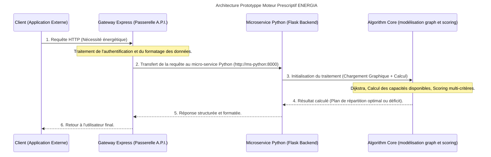

# Projet ENERGIA : Système d'aide à la décision pour le pilotage de parc nucléaire

Ce projet est une intervention complète visant à moderniser le système d'aide à la décision (SAD) d'un grand compte du secteur de l'énergie. Son objectif principal est de déterminer, en temps réel et de manière optimale, un ajustement des ressources de production capable de satisfaire les besoins énergétiques fluctuants observés sur le réseau nucléaire, ou de quantifier précisément le déficit en cas d'impossibilité de couverture.

## Architecture globale du système

Le système est conçu selon une architecture orientée microservices pour garantir la scalabilité et l'isolation des préoccupations (separation of concerns). Le flux de données suit un chemin strict, passant toujours par une passerelle unique.

### Schéma de flux séquentiel



### Composants techniques principaux

* **Gateway Express (gateway/):** la passerelle API (Node.js/Express).
    C'est le seul point d'entrée autorisé pour tout client externe. Elle gère le routage, la validation des requêtes et assure que les communications internes se font via un protocole strict vers le backend Python.

* **Service Python (ms-python/):** le cœur de la logique métier.
    Ce micro-service implémente l'ensemble des calculs complexes : modélisation du réseau, algorithmes de cheminement et d'optimisation. Il est construit en utilisant Flask pour exposer ses fonctionnalités via une API REST interne.

* **Moteur algorithmique (modélisation graph):** les traitements lourds
    **Modélisation :** Traitement des données du parc nucléaire (nodes/sommets = centrales, edges/arêtes = liaisons).
    **Optimisation de cheminement :** Implémentation de l'algorithme de Dijkstra pour trouver le chemin le plus court entre deux points dans le réseau maillé.
    **Calcul des capacités disponibles :** Détermination de la puissance disponible en fonction du minimum entre les limites supérieures (soft upper bound) et la rampe de montée maximale (max_ramp_up_mw_per_15_min).

### Données utilisées

Les données sont structurées autour des trois piliers suivants :

* **Graphe du réseau :** Représentation physique des centrales et liaisons (pondérées par la distance, les pertes techniques et la capacité maximale).
* **Données géographiques :** Incluant la segmentation en régions et un inventaire de centrales.
* **Besoin régional :** Le flux d'entrée qui déclenche toute simulation (le besoin de MW).

### Méthodologie algorithmique détaillée

L'algorithme principal est une cascade séquentielle de calculs visant à produire le plan optimal avec le score minimal.
**Priorisation des Sources :** La recherche priorise toujours les centrales locales (dans la région demandée) avant d'explorer tout le graphe via Dijkstra, garantissant une logique opérationnelle terrain.

**Calcul du Score Global :** Chaque centrale candidate reçoit un score composite pour évaluer son meilleur rôle dans la réponse énergétique :
\[
\text{Score} = (\text{Distance}_{\text{km}} \times 1.0) + (\text{Pertes}_{\%} \times 45.0) + ((\text{Taux de Charge Final})^4 \times 900.0) + \text{Pénalité Technique} \times 200.0 - [250 \text{ si centrale locale}]
\]Le plus petit score indique la candidate la plus performante pour répondre au besoin global.

**Répartition de la demande :** Les candidates sont triées par ordre croissant de leur Score. La demande est ensuite distribuée séquentiellement à chaque centrale, en respectant sa marge disponible (sans dépasser ni le plafond ni les limites des liaisons).

**Cas d'échec :** Si le total cumulé des MW disponibles reste inférieur au besoin initial, le système doit impérativement répondre avec le nombre exact de MWh manquants et un message clair.

### Tests Unitaires

Le système doit être robuste et le test des comportements suivants est crucial :

* Chemin simple Dijkstra fonctionnel
* Scénario d'absence de chemin viable (connectivité rompue)
* Calcul précis de la capacité disponible en cas de contrainte technique
* Satisfaction totale ou partielle de la demande énergétique simulée

## Démarrage et utilisation

### Prérequis techniques

* **Python :** Des dépendances spécifiques sont listées dans ms-python/requirements.txt.
* **Node.js :** La passerelle d'API requiert un environnement Node.js actif.

### Lancement de l'environnement (via Docker)

L'environnement complet est géré via le fichier docker-compose.yml à la racine :
```docker compose up --build```

**Ce processus lance simultanément :**

* Le micro-service Python (ms-python) écoutant sur le port 8000 (interne).
* La passerelle Node.js (gateway) écoutant sur le port 3000 (externe).

### Terminaisons _(Endpoints)_ de l'API  exposé(e)s

| Service         | Endpoint  | Méthode  | Description                                                   |
| --------------- | --------- | -------- | ------------------------------------------------------------- |
| Gateway Express | /gateway  | GET/POST | Point d'entrée client pour toute simulation                   |
| ms Python       | /plants   | GET      | Récupère la liste de toutes les centrales du parc             |
| ms Python       | /regions  | GET      | Liste des régions géographiques couvertes                     |
| ms Python       | /network  | GET      | Détails structurels et topologiques du réseau                 |
| ms Python       | /simulate | POST     | Endpoint principal. Reçoit un besoin énergétique et déclenche |
⚠️ Important : Le client ne doit jamais communiquer directement avec le service Python. Toute interaction doit passer par la Gateway Express (port 3000).